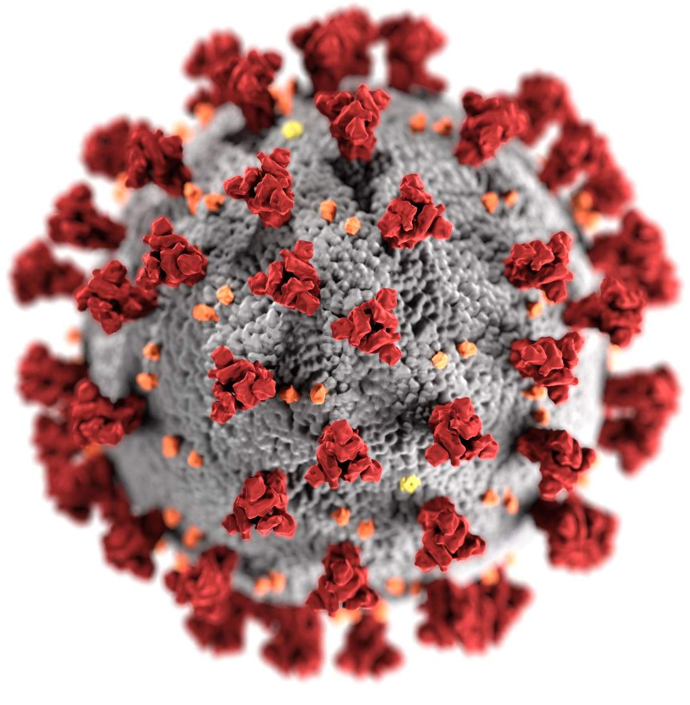

[](https://hits.dwyl.com/swapnanildutta/CoronavirusDatabase)
[](https://makeapullrequest.com)

[![Contributors][contributors-shield]][contributors-url]
[![Forks][forks-shield]][forks-url]
[![Stargazers][stars-shield]][stars-url]
[![Issues][issues-shield]][issues-url]
[](https://github.com/swapnanildutta/CoronavirusDatabase)

<!-- PROJECT LOGO -->
<br />
<p align="center">
  <a href="https://github.com/swapnanildutta/CoronavirusDatabase">
    
  </a>
  <h3 align="center">Corona-Virus-Database</h3>
</p>

<!-- TABLE OF CONTENTS -->

## Table of Contents

- [Corona Virus Database](#corona-virus-database)
    - [Built With](#built-with)
  - [Getting Started](#getting-started)
    - [Installation](#installation)
  - [Usage](#usage)
  - [Roadmap](#roadmap)
  - [Contributing](#contributing)
  - [License](#license)
  - [Contact](#contact)
  - [Acknowledgements](#acknowledgements)

<!-- ABOUT THE PROJECT -->

## About The Project

<p align="center">
  <a href="https://github.com/swapnanildutta/CoronavirusDatabase">
    <!-- You can add logo for your CoronaVirus -->
    <!--  -->
  </a>
</p>

# Corona Virus Database

I have used web scraping to collect the data and stored it into a .json file and further using the .json file to add to SQLite Database and also trying to make an API using Flask.

### Built With

This section should list any major frameworks that you built your project using. Leave any add-ons/plugins for the acknowledgements section. Here are a few examples.

- [Python](https://www.python.org/)

<!-- GETTING STARTED -->

## Getting Started

This is an example of how you may give instructions on setting up your project locally.
To get a local copy up and running follow these simple example steps.

### Installation

Clone the repo

```sh
 git clone https://github.com/swapnanildutta/CoronavirusDatabase.git
```

Change the dir

```sh
cd CoronavirusDatabse
```

<!-- You can change the cmd if you want -->

Run CoronavirusDatabse

```sh
python coronavirusweb.py
```

<!-- USAGE EXAMPLES -->

## Usage

I have used web scraping to collect the data and stored it into a .json file and further using the .json file to add to SQLite Database and also trying to make an API using Flask.

- add some more features.
- use pictures for demo if you can
- or use gif images here if you want

<!-- Here you can add documentation link for the more user-understanble -->

_For more examples, please refer to the [Documentation]()_

<!-- ROADMAP -->

## Roadmap

See the [open issues](https://github.com/swapnanildutta/CoronavirusDatabase) for a list of proposed features (and known issues).

<!-- CONTRIBUTING -->

## Contributing

Contributions are what make the open source community such an amazing place to be learn, inspire, and create. Any contributions you make are **greatly appreciated**.

1. Fork the Project
2. Create your Feature Branch (`git checkout -b feature/AmazingFeature`)
3. Commit your Changes (`git commit -m 'Add some AmazingFeature'`)
4. Push to the Branch (`git push origin feature/AmazingFeature`)
5. Open a Pull Request

<!-- LICENSE -->

## License

<!-- Here you can add license link  -->

Distributed under the License. See [`LICENSE`](https://choosealicense.com/licenses/mit/) for more information.

<!-- CONTACT -->

## Contact

Project Link: [https://github.com/swapnanildutta/CoronavirusDatabase](https://github.com/swapnanildutta/CoronavirusDatabase)

<!-- ACKNOWLEDGEMENTS -->

## Acknowledgements

- [Img Shields](https://shields.io)
- [Choose an Open Source License](https://choosealicense.com)

<!-- MARKDOWN LINKS & IMAGES -->
<!-- https://www.markdownguide.org/basic-syntax/#reference-style-links -->

[contributors-shield]: https://img.shields.io/github/contributors/swapnanildutta/CoronavirusDatabase.svg?style=flat
[contributors-url]: https://github.com/swapnanildutta/CoronavirusDatabase/graphs/contributors
[forks-shield]: https://img.shields.io/github/forks/swapnanildutta/CoronavirusDatabase.svg?style=flat
[forks-url]: https://github.com/swapnanildutta/CoronavirusDatabase/network/members
[stars-shield]: https://img.shields.io/github/stars/swapnanildutta/CoronavirusDatabase.svg?style=flat
[stars-url]: https://github.com/swapnanildutta/CoronavirusDatabase/stargazers
[issues-shield]: https://img.shields.io/github/issues/swapnanildutta/CoronavirusDatabase.svg?style=flat
[issues-url]: https://github.com/swapnanildutta/CoronavirusDatabase/issues
